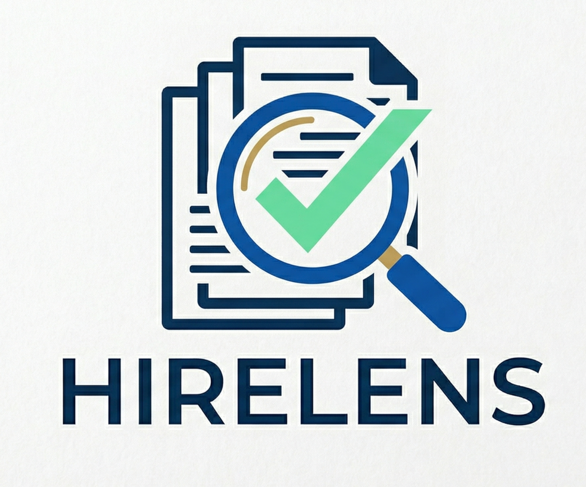
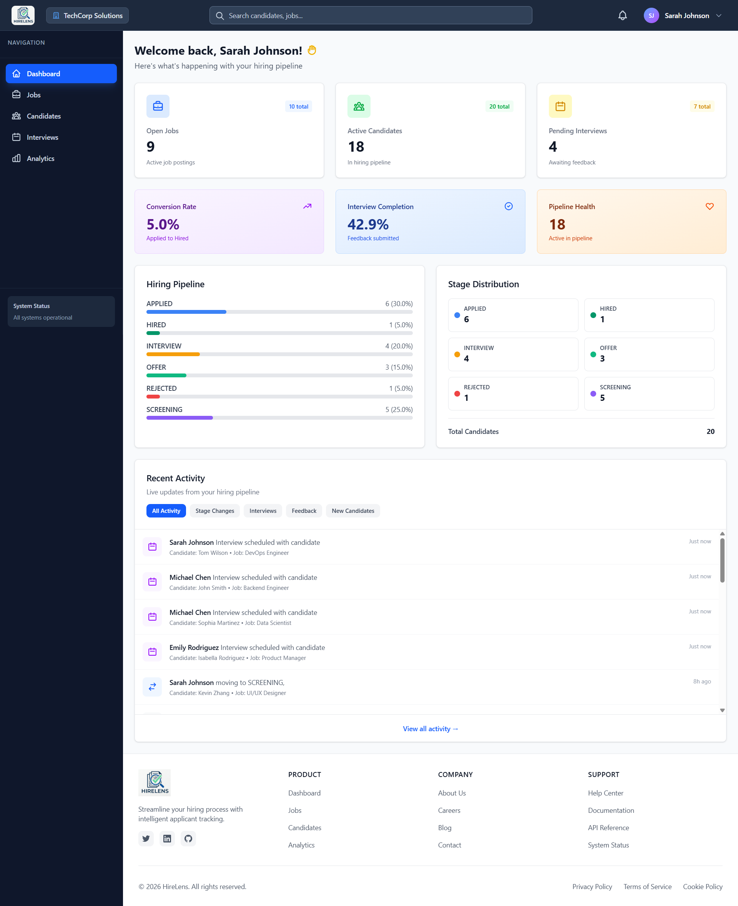
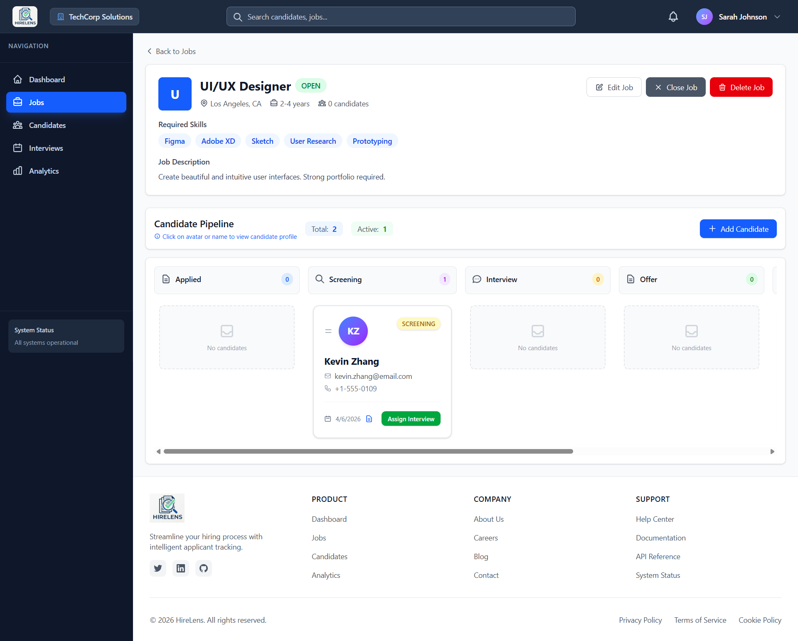
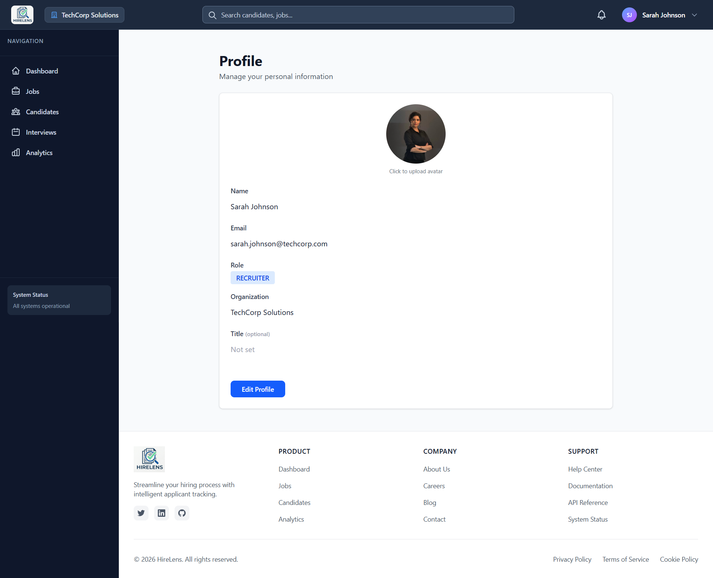
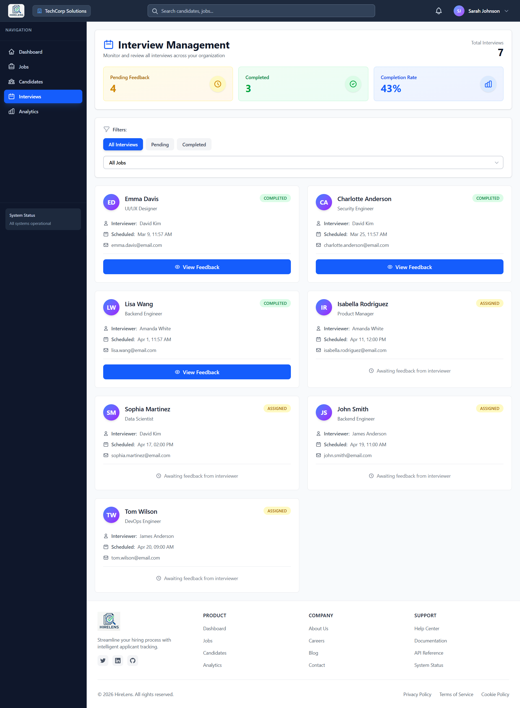
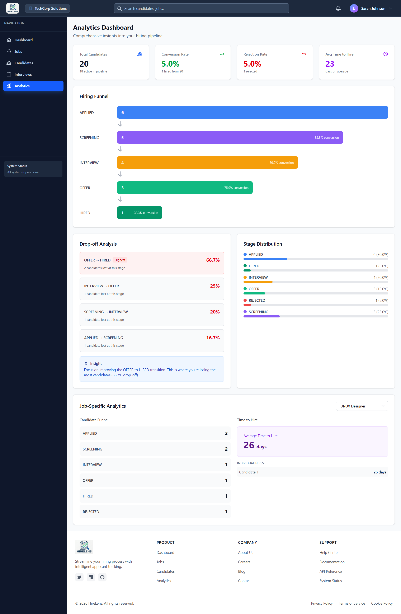
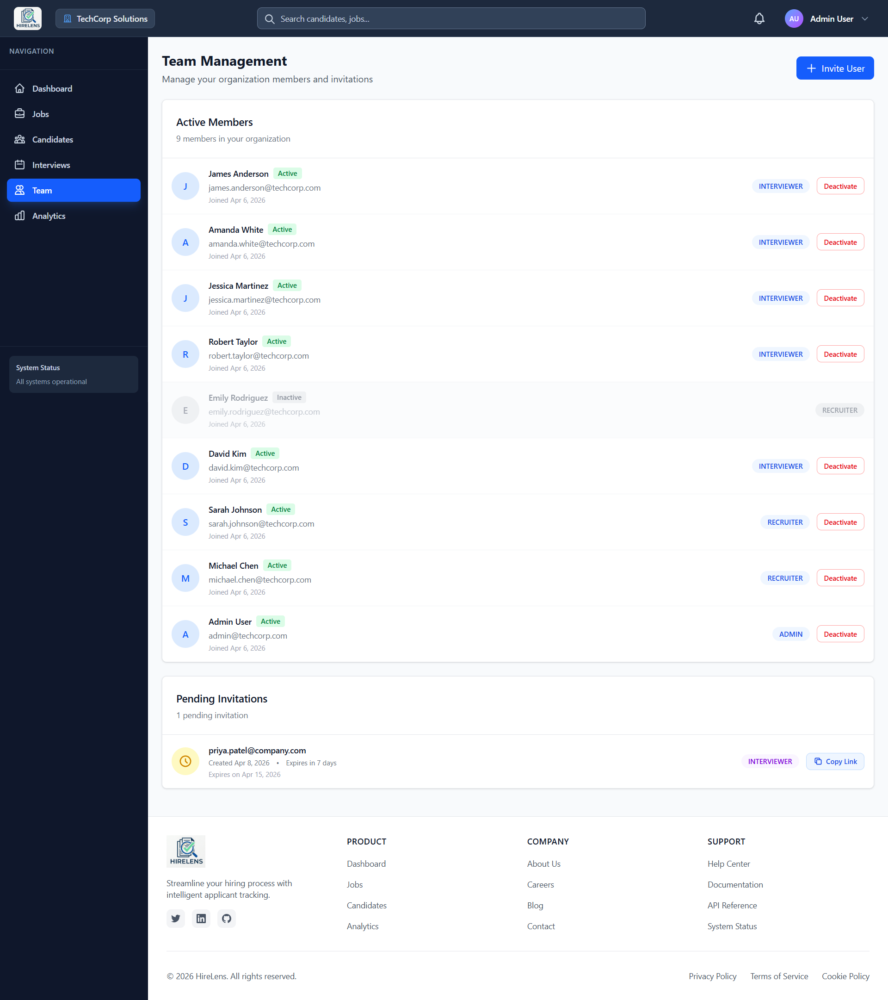

<div align="center">
  

  <h1>HireLens</h1>
  <p><strong>A full-stack Applicant Tracking System built for modern hiring teams</strong></p>

  <p>
    <a href="https://hire-lens-frontend-ebon.vercel.app" target="_blank">
      
    </a>
    
    
    
    
  </p>

  <p>
    
    
    
  </p>
</div>

---

## 📌 Overview

**HireLens** is a production-ready Applicant Tracking System (ATS) that streamlines the entire hiring workflow — from posting jobs and tracking candidates through a visual pipeline, to assigning interviewers, collecting structured feedback, and analyzing hiring metrics.

Built with a role-based access model supporting **Admins**, **Recruiters**, and **Interviewers**, HireLens delivers a clean, responsive experience on both desktop and mobile.

> 🔗 **Live App:** [hire-lens-frontend-ebon.vercel.app](https://hire-lens-frontend-ebon.vercel.app)  
> 🔗 **Backend Repo:** [HireLens Backend](https://github.com/Saroj05Dev/HireLensBackend)

---

## ✨ Features

### 🔐 Authentication & Authorization
- JWT-based auth with **httpOnly cookies** (access + refresh tokens)
- Auto token refresh via Axios interceptor
- Role-based route protection: `ADMIN`, `RECRUITER`, `INTERVIEWER`
- Team invitation system — invite members via email with secure token links
- Secure logout that clears cookies on both client and server

### 📊 Dashboard
- Real-time hiring pipeline stats (open jobs, active candidates, pending interviews)
- Visual pipeline funnel and stage distribution charts
- Live activity feed with filters (stage changes, interviews, feedback, new candidates)
- Conversion rate and interview completion metrics
- Clickable stat cards for quick navigation

### 💼 Job Management
- Create, edit, close, reopen, and delete job postings
- Job details page with full candidate pipeline board
- Drag-and-drop style stage transitions with validation (no stage skipping)
- Toast notifications for invalid stage moves

### 👥 Candidate Pipeline
- Kanban-style pipeline board per job
- Add candidates with resume upload (Cloudinary)
- Candidate profile modal with tabbed view:
  - **Details** — contact info, skills, notes
  - **Decision Timeline** — full audit log of all stage changes and actions
  - **Interviews** — all assigned interviews with feedback status
- Global candidate search across all jobs
- Stage filter and real-time updates via Socket.IO

### 🗓️ Interview Management
- Assign interviews to team members with scheduled date/time
- **Admin/Recruiter view** — full interview list with status filters
- **Interviewer view** — personal task list of pending feedbacks
- Structured feedback form with ratings and hire recommendation
- Real-time notification to recruiter when feedback is submitted

### 📋 Feedback System
- Per-interview feedback with:
  - Overall rating (1–5)
  - Skill-specific ratings
  - Strengths and areas of improvement
  - Hire recommendation (Proceed / Hold / Reject)
- Feedback viewer for recruiters with full breakdown

### 🔔 Notifications
- Real-time in-app notifications via Socket.IO
- Unread count badge on bell icon
- Notification dropdown with mark-as-read
- Notifications for: interview assignments, feedback submissions, stage changes

### 📈 Analytics
- Hiring funnel visualization per job
- Time-to-hire metrics
- Stage conversion rates
- Organization-wide hiring trends

### 👨‍👩‍👧 Team Management (Admin only)
- Invite team members by email with role assignment
- View all active members with roles
- Manage pending invitations
- Remove team members

### 🎨 UI/UX
- Fully responsive — mobile-first design with bottom navigation
- Bouncing dots loading states (no boring spinners)
- Toast notification system (success, error, warning, info)
- Role-aware search bar (candidates/jobs for recruiters, pending feedbacks for interviewers)
- Real-time activity feed with pagination
- Smooth tab switching with scroll reset

---

## 🛠️ Tech Stack

| Category | Technology |
|---|---|
| Framework | React 19 |
| Build Tool | Vite 7 |
| State Management | Redux Toolkit + React-Redux |
| Routing | React Router DOM v7 |
| Styling | Tailwind CSS v4 |
| Forms | React Hook Form |
| HTTP Client | Axios (with interceptors) |
| Real-time | Socket.IO Client |
| Auth | JWT via httpOnly Cookies |
| Deployment | Vercel |

---

## 🏗️ Project Structure

```
hire-lens-frontend/
├── public/
│   ├── favicon.png
│   └── images/
│       └── hirelens-logo.png
│
├── src/
│   ├── App.jsx                    # Root component, ToastProvider
│   ├── main.jsx                   # Entry point, Redux Provider
│   │
│   ├── components/
│   │   ├── layouts/
│   │   │   ├── Layout.jsx         # Main app shell (navbar + sidebar + content)
│   │   │   ├── Navbar.jsx         # Top nav with search, notifications, user menu
│   │   │   ├── Sidebar.jsx        # Desktop sidebar navigation
│   │   │   ├── MobileBottomNav.jsx# Mobile bottom tab bar
│   │   │   ├── Footer.jsx
│   │   │   └── SearchBar.jsx      # Global search (candidates + jobs)
│   │   ├── notifications/
│   │   │   └── NotificationDropdown.jsx
│   │   └── ui/
│   │       ├── Loader.jsx         # Bouncing dots loader
│   │       └── Toast.jsx          # Toast notification system
│   │
│   ├── features/
│   │   ├── auth/
│   │   │   ├── authSlice.js       # Auth state, login/logout/fetchMe thunks
│   │   │   ├── auth.api.js
│   │   │   ├── login/Login.jsx
│   │   │   └── signup/Signup.jsx
│   │   ├── candidates/
│   │   │   ├── candidateSlice.js
│   │   │   ├── candidate.api.js
│   │   │   ├── CandidateContainer.jsx  # Main candidates page
│   │   │   ├── CandidateCard.jsx       # Kanban card
│   │   │   ├── CandidateProfile.jsx    # Profile modal (Details/Timeline/Interviews)
│   │   │   ├── CandidatePresenter.jsx
│   │   │   └── AddCandidate.jsx
│   │   ├── interviews/
│   │   │   ├── interviewSlice.js
│   │   │   ├── interview.api.js
│   │   │   ├── InterviewsContainer.jsx # Admin/Recruiter view
│   │   │   ├── InterviewTasksPage.jsx  # Interviewer view
│   │   │   ├── InterviewCard.jsx
│   │   │   ├── AssignInterview.jsx
│   │   │   ├── FeedbackForm.jsx
│   │   │   └── FeedbackViewer.jsx
│   │   ├── jobs/
│   │   │   ├── jobsSlice.js
│   │   │   ├── job.api.js
│   │   │   ├── JobsPage.jsx
│   │   │   ├── JobList.jsx
│   │   │   ├── JobDetailsPage.jsx
│   │   │   ├── PipelineBoard.jsx       # Kanban pipeline per job
│   │   │   ├── CreateJob.jsx
│   │   │   └── EditJob.jsx
│   │   ├── notifications/
│   │   │   └── notificationSlice.js
│   │   ├── profile/
│   │   │   └── profileSlice.js
│   │   └── team/
│   │       ├── teamSlice.js
│   │       ├── team.api.js
│   │       ├── InviteUserModal.jsx
│   │       ├── MembersList.jsx
│   │       └── PendingInvitesList.jsx
│   │
│   ├── helpers/
│   │   ├── axiosInstance.js       # Axios with auto token refresh interceptor
│   │   └── socket.js              # Socket.IO connection helpers
│   │
│   ├── pages/
│   │   ├── Dashboard.jsx
│   │   ├── Analytics.jsx
│   │   ├── ActivityPage.jsx       # Full activity history with pagination
│   │   ├── TeamPage.jsx
│   │   ├── ProfilePage.jsx
│   │   └── AcceptInvitePage.jsx   # Team invite acceptance flow
│   │
│   ├── routes/
│   │   ├── index.jsx              # All routes with role-based guards
│   │   └── ProtectedRoute.jsx
│   │
│   └── store/
│       ├── index.js
│       └── rootReducer.js
│
├── index.html
├── vite.config.js
├── eslint.config.js
└── package.json
```

---

## 🚀 Getting Started

### Prerequisites

- Node.js 18+
- npm or yarn
- Backend running (see [HireLens Backend](https://github.com/Saroj05Dev/HireLensBackend))

### Installation

```bash
# Clone the repository
git clone https://github.com/Saroj05Dev/HireLensFrontend.git
cd HireLensFrontend

# Install dependencies
npm install

# Set up environment variables
cp .env.example .env
```

### Environment Variables

```env
VITE_API_BASE_URL=http://localhost:5000/api/v1
VITE_SOCKET_URL=http://localhost:5000
```

### Running Locally

```bash
# Start development server
npm run dev

# Build for production
npm run build

# Preview production build
npm run preview
```

---

## 👤 Role-Based Access

| Feature | Admin | Recruiter | Interviewer |
|---|:---:|:---:|:---:|
| Dashboard | ✅ | ✅ | ❌ |
| Jobs | ✅ | ✅ | ❌ |
| Candidates | ✅ | ✅ | ❌ |
| Interviews (full) | ✅ | ✅ | ❌ |
| My Interview Tasks | ✅ | ✅ | ✅ |
| Submit Feedback | ✅ | ✅ | ✅ |
| Analytics | ✅ | ✅ | ❌ |
| Team Management | ✅ | ❌ | ❌ |
| Activity Feed | ✅ | ✅ | ✅ |
| Profile | ✅ | ✅ | ✅ |

---

## 🔄 Real-time Features

HireLens uses **Socket.IO** for live updates across all connected clients:

- 🟢 Candidate stage changes broadcast to all team members
- 🟢 New interview assignments notify the assigned interviewer instantly
- 🟢 Feedback submissions notify the recruiter in real-time
- 🟢 Activity feed updates live without page refresh
- 🟢 Notification badge count updates in real-time

---

## 🔒 Security

- **httpOnly cookies** — tokens are never accessible via JavaScript
- **Auto token refresh** — seamless session renewal via Axios interceptor
- **Secure logout** — cookies cleared on both client and server with matching `sameSite`/`secure` attributes
- **Role-based route guards** — unauthorized access redirects automatically
- **CORS** configured for production domain only

---

## 📦 Deployment

The frontend is deployed on **Vercel** with automatic deployments on every push to `main`.

```
Production: https://hire-lens-frontend-ebon.vercel.app
Backend:    https://hirelensbackend.onrender.com
```

> ⚠️ The backend runs on Render's free tier — first request may take ~30 seconds to wake up.

---

## 🤝 Backend

This is the frontend repository. The backend (Node.js + Express + MongoDB) is in a separate repo:

👉 [HireLens Backend](https://github.com/Saroj05Dev/HireLensBackend)

**Backend stack:** Node.js · Express · MongoDB · Mongoose · Socket.IO · JWT · Cloudinary · Nodemailer

---

## 📸 Screenshots

> Add screenshots to a `/screenshots` folder and update the paths below.

| Dashboard | Pipeline Board |
|---|---|
|  |  |

| Candidate Profile | Interview Tasks |
|---|---|
|  |  |

| Analytics | Team Management |
|---|---|
|  |  |

---

## 🧑‍💻 Author

**Saroj Kumar Das**

- GitHub: [@Saroj05Dev](https://github.com/Saroj05Dev)

---

<div align="center">
  <p>Built with ❤️ using React, Redux Toolkit, and Tailwind CSS</p>
  <p>⭐ Star this repo if you found it useful!</p>
</div>
